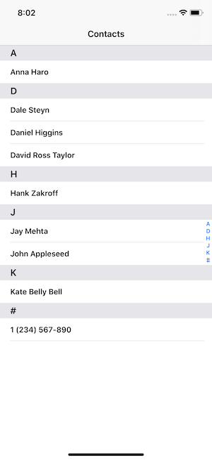
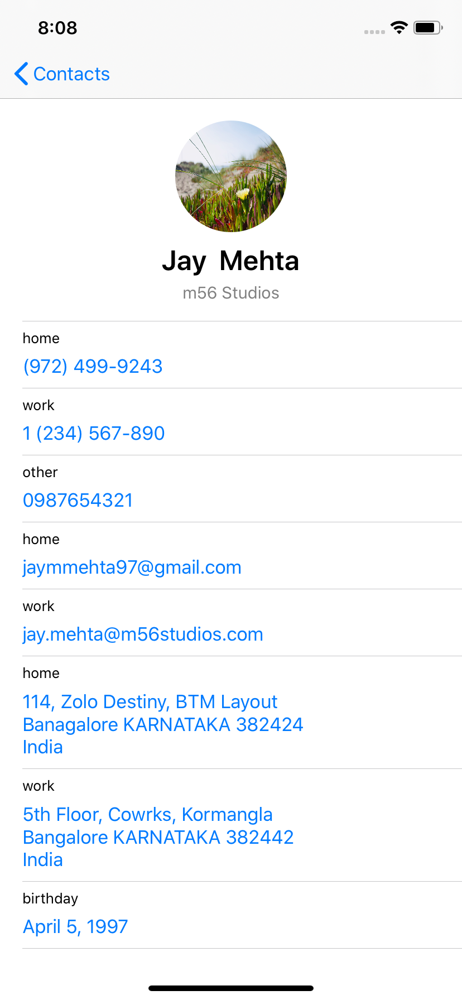
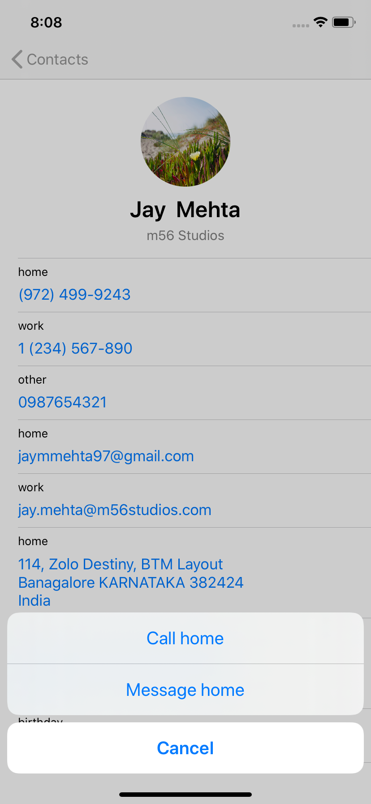
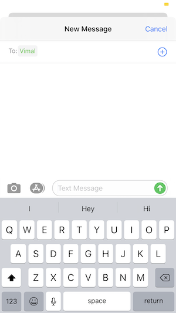
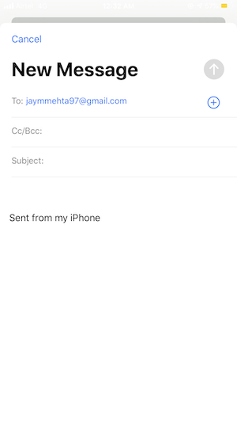

# Contacts

Contacts app for iOS platform.

Architecture :- MVVM  
IDE :- Xcode 11  
Language :- Swift 5  
Design :- Inspired by iOS native contacts app  

# Functionality

The application performs very simple functionality of retrieving contacts from address book and showing user details. 

The user is requested for permission as soon as the app is launched. On request being granted, contacts are fetched and stored temporarily. Contacts are sorted by their first name and displayed in a tableview. The first screen shows a list of all the contacts in device with a section navigator bar on right hand side for easy navigation.

To sync with the address book as soon as any update in contacts has been made, we set observor to monitor changes in contacts. If any change occurs in the address book then the event gets fired when the user brings our app to foreground. On receiving this event we re-fetch all our contacts and reload the tableview. It would have been effiecient to only update the changes rather than updating everything but that is not possible as the API only call's event without passing any data.

Conatcts which do not have any name are displayed under `#`.

On selection of a contact we push the second screen which shows details of user including profile photo, full name, organization name, phone numbers, email addresses, postal addresses and birthdate.

All the phone numbers, email and postal addresses are displayed with their respective labels.

On selecting any phone number the user gets an action sheet with options to either call or message on that number. 

If the user opts to send a message then a `MFMessageComposeViewController` is presented with the contact in receipient list.

On selecting any of the email address user is presented a `MFMailComposeViewController` with contact's email address in receipient list.

## Libraries used

###SwiftLint

It is a tool to enforce Swift style and conventions, loosely based on [GitHub's Swift Style Guide](https://github.com/github/swift-style-guide).

